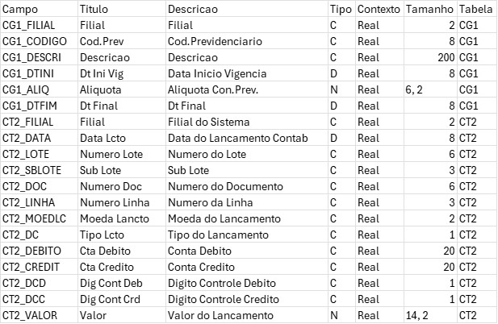

# Protheus Tables Web Scraper


A web scraper built with Python to extract and structure Protheus table documentation from [Terminal de Informação](https://terminaldeinformacao.com/), facilitating data exploration and integration into analytics pipelines.

## Acknowledgements

- A huge thanks to [Terminal de Informação](https://terminaldeinformacao.com/) for making the Protheus table documentation publicly available.  
- This project would not be possible without their effort to organize and share the information with the community.

> **Note:** This project is an independent initiative and is not officially affiliated with Terminal de Informação.

---

## Features

- Automated scraping of all available Protheus tables
- Extraction of fields, indexes, and relationships
- Output as partitioned Parquet files for Data Lake compatibility
- Multithreaded processing for faster scraping
- Handles missing data and inconsistent rows

---

## Preview



---

## Table of Contents

- [Installation](#installation)
- [Usage](#usage)
- [Contributing](#contributing)
- [License](#license)
- [Author](#author)

---

## Installation

Clone the repository and install the dependencies:

```bash
git clone https://github.com/EliasCid/protheus_tables_web_scraper
cd protheus_tables_web_scraper
pip install poetry
poetry install
```

## Usage

To start web scraper:

```bash
python protheus_tables_scraper.py
```

To save files in .csv format:

```bash
python protheus_tables.py
```

## Contributing

Pull requests are welcome! Feel free to open issues to discuss features or bugs.

## License

This project is licensed under the [MIT License](LICENSE).